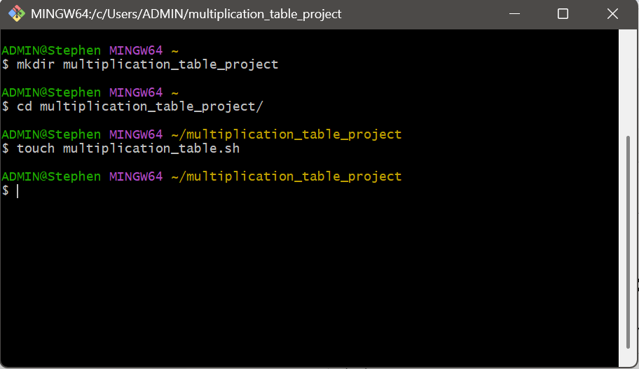
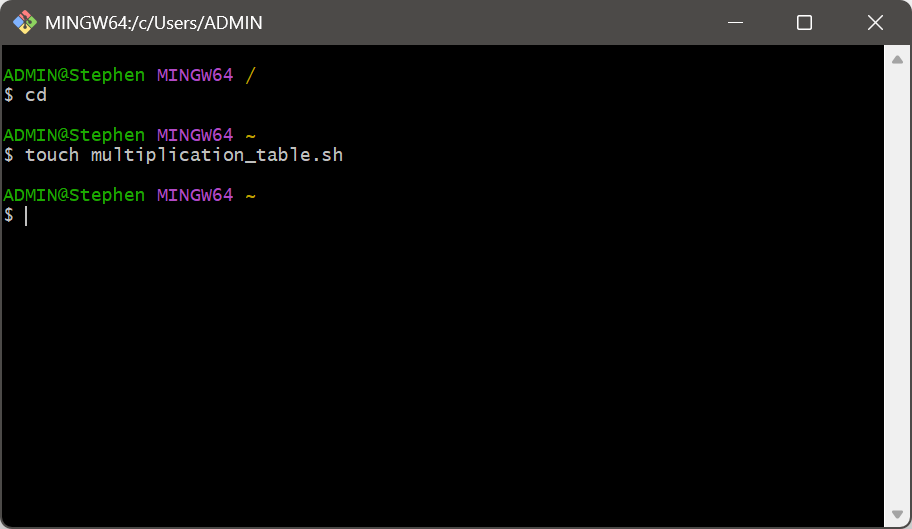
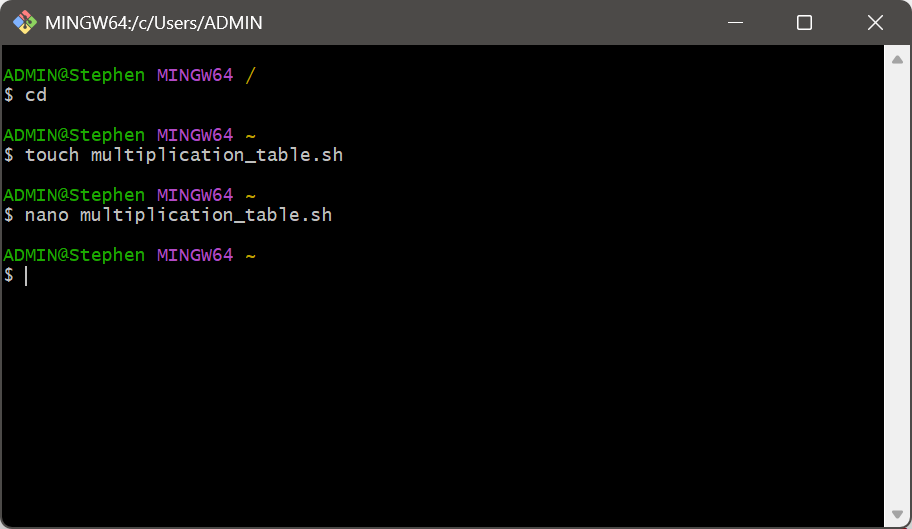
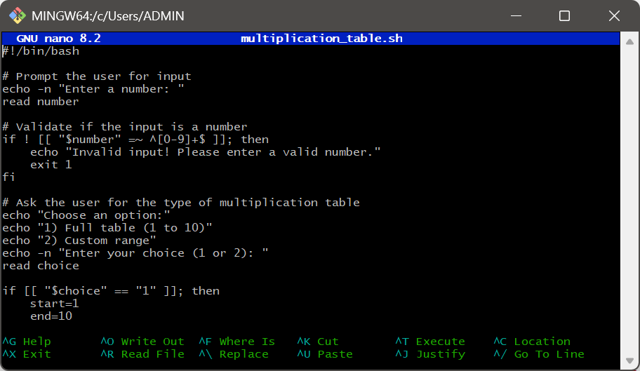
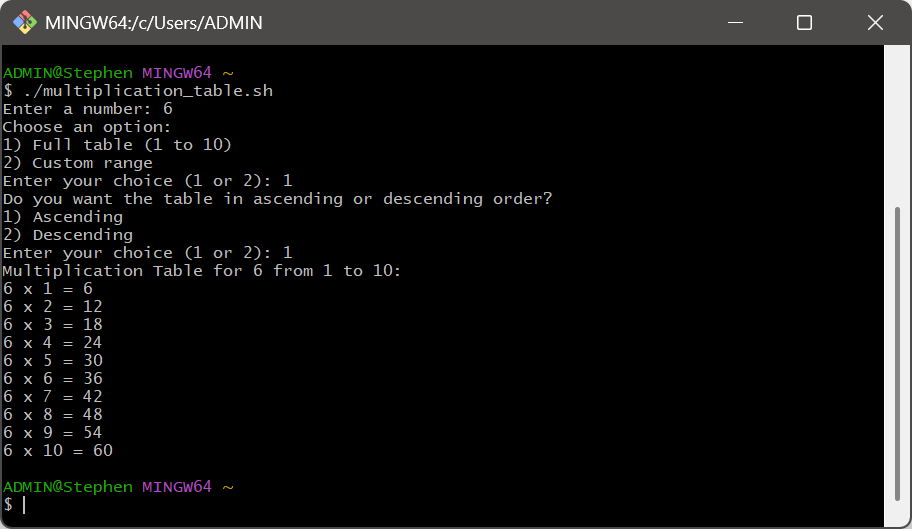

# CAPSTONE PROJECT- BASH SCRIPT ON GENERATING MULTIPLICATION TABLE

__Step 1:__ Create a Directory using mkdir multiplication_table_project then navigate into the directory using cd multiplication_table_project

__Step 2:__ Create the Bash Script filr using touch multiplication_table.sh

__Step 3:__ Open the Script for editing using 
nano multiplication_table.sh

__Step 4:__ Write the script below and make it executable.

__Step 7:__ Run the Script using ./multiplication_table.sh

